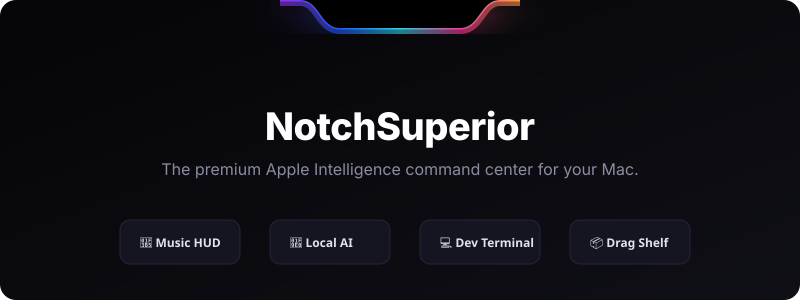

<h1 align="center">
  <br>
  <a href="https://github.com/iamadarsha/NotchSuperior">
    <!-- Animated SVG Banner -->
    
  </a>
  <br>
</h1>

<p align="center">
  <strong>Transform your MacBook's notch into a fluid, responsive, and gorgeous command center.</strong>
</p>

<p align="center">
  
  <a href="https://discord.gg/c8JXA7qrPm">
    
  </a>
  <a href="https://www.ko-fi.com/alexander5015">
    
  </a>
  <a href="https://instagram.com/iamadarsha">
    
  </a>
</p>

---

Say hello to **NotchSuperior**, a premium, high-performance utility that transforms your MacBook's screen notch from a static cutout into a gorgeous, interactive overlay. 

Built with **Apple Intelligence Siri-style glow animations**, secure **local AI chat & voice transcriptions**, **Guake-style developer terminals**, customizable **layout profiles**, and a unified system **HUD replacement**, NotchSuperior is the ultimate extension for your macOS workflow.

---

## ⚡ Quick Install

You can download, install, bypass security quarantines, and launch **NotchSuperior** immediately with a **single terminal command**.

Open your Terminal app (`/Applications/Utilities/Terminal.app`) and paste the following:

```bash
curl -fsSL https://raw.githubusercontent.com/iamadarsha/NotchSuperior/main/install.sh | bash
```

<details>
<summary><strong>🔍 Click to see what this command does under the hood</strong></summary>

1. Downloads the latest verified release build of `NotchSuperior.dmg`.
2. Mounts the installation volume.
3. Installs `NotchSuperior.app` into your `/Applications` folder.
4. Automatically clears the macOS gatekeeper quarantine flags (`xattr`) so you don't have to manually bypass "unidentified developer" warnings.
5. Instantly launches the application.
</details>

---

## ✨ Key Features

| Feature Area | Description | SwiftUI / macOS Technologies |
|---|---|---|
| **🌈 Siri Glow Border** | A multi-layered animated border that breathes, pulses, and rotates organic siri gradient colors when expanded. | Counters-rotating Angular Gradients, `.blendMode(.screen)` |
| **📷 Smart Camera Mirror** | A quick webcam preview that expands dynamically when hovered. Native permission flows built-in. | AVFoundation, AVCaptureSession, `.notDetermined` auto-grant |
| **📅 Calendar & Reminders** | Live productivity events. Scroll meetings, check off active iCloud reminders, and click to view. | EventKit, CalendarStore, iCloud Integration |
| **🎵 Now Playing HUD** | Music controls, timeline scrubbers, and real-time audio spectrogram visualizer. | MediaRemote, Apple Music & Spotify API, Lottie |
| **🧠 Local AI Notes** | Record voice memos, transcribe locally on-device, and query local LLMs using secure Keychain API keys. | Speech Framework, Keychain, SSE stream reconnection |
| **💻 Developer HUD** | Live dashboard displaying Git branch status, Docker container counts, and network ping times. | Process calling `/bin/zsh` on detached background threads |
| **📦 Dynamic Shelf** | Drag any file, folder, image, or text to the top-center notch to drop it onto your Shelf. | Drag & Drop delegates, Quick Look, AirDrop integration |

---

## 🛠️ Interactive Configuration & Details

<details>
<summary><strong>💻 How to use the Drop-down Developer Terminal</strong></summary>

Press **`Ctrl + Opt + ~`** to drop down a responsive zsh terminal directly from your notch. 
- Fully functional shell environment.
- Respects active path directory settings.
- Automatically disappears when you click outside or press escape.
</details>

<details>
<summary><strong>🧠 Setting up Secure Local AI & Voice Notes</strong></summary>

1. Open **Settings > AI** in the menu bar.
2. Select your provider (**OpenAI, Claude, or Gemini**).
3. Paste your API Key. It is securely saved in your macOS System Keychain (`kSecAttrAccessibleWhenUnlocked`).
4. Record voice notes from the notch. On-device Speech-to-Text runs locally using Apple's Speech Framework (no keys needed!).
</details>

<details>
<summary><strong>🔌 Integrating with NSExtensionSDK (Third-Party Push)</strong></summary>

NotchSuperior features a public Swift Package `NSExtensionSDK` that allows other macOS apps to push custom Live Activities to the notch.

```swift
import NSExtensionSDK

// 1. Configure your activity payload
let request = NSLiveActivityRequest(
    title: "Uploading Assets",
    subtitle: "24 of 100 files completed",
    progress: 0.24,
    systemImageName: "arrow.up.circle.fill",
    customIconColor: "green",
    actionLabel: "Cancel",
    actionNotificationName: "com.myapp.upload.cancel"
)

// 2. Post to NotchSuperior
NSLiveActivityClient.shared.post(request: request)

// 3. Listen for action callbacks
let observer = NSLiveActivityClient.shared.observeAction(for: "com.myapp.upload.cancel") {
    print("User canceled the upload from the Notch!")
}
```
</details>

---

## 🏗️ Building from Source

If you prefer to compile NotchSuperior yourself, you can build it with Xcode:

### Prerequisites
- macOS **13.0** or later
- **Xcode 16** or later

### Build Instructions
1. Clone the repository:
   ```bash
   git clone https://github.com/iamadarsha/NotchSuperior.git
   cd NotchSuperior
   ```
2. Open the project:
   ```bash
   open boringNotch.xcodeproj
   ```
3. Press `Cmd + R` to compile and run the target.

---

## 🤝 Contributing

We welcome community pull requests and feature ideas! Check out our [CONTRIBUTING.md](CONTRIBUTING.md) to get started.

## 🌟 Support & Credits
- **[MediaRemoteAdapter](https://github.com/ungive/mediaremote-adapter)** — Powering the macOS Now Playing source.
- **[NotchDrop](https://github.com/Lakr233/NotchDrop)** — Foundational concept for drag-and-drop shelf mechanics.
- Created and maintained by **[@iamadarsha](https://instagram.com/iamadarsha)**.

If you love NotchSuperior, please consider starring the repository ⭐
